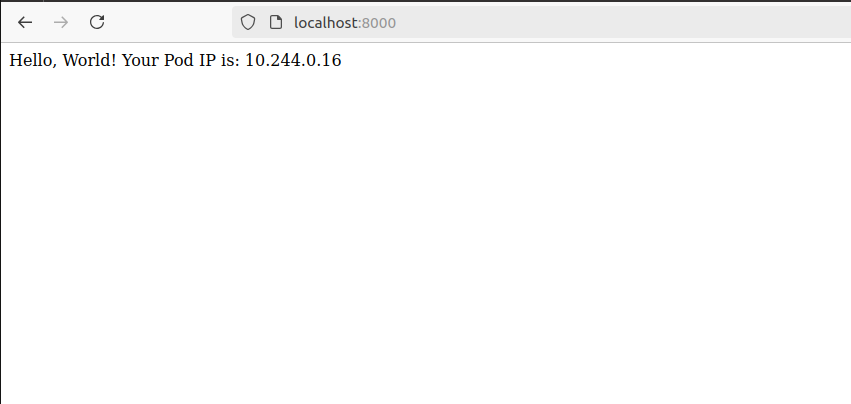

### Шаги выполнения
1. Создан манифест namespace.yml
2. Создан манифест pod.yml
3. Ввод команд:
   ```
    $ kubectl apply -f namespace.yaml 
    $ kubectl apply -f pod.yaml
    $ kubectl port-forward pod/homework-pod 8000:80 -n homework
   ```
---------
Результат:

